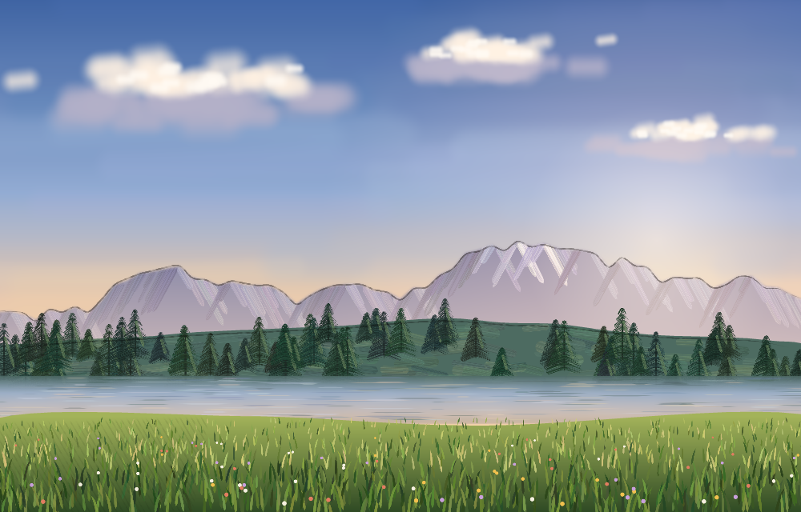
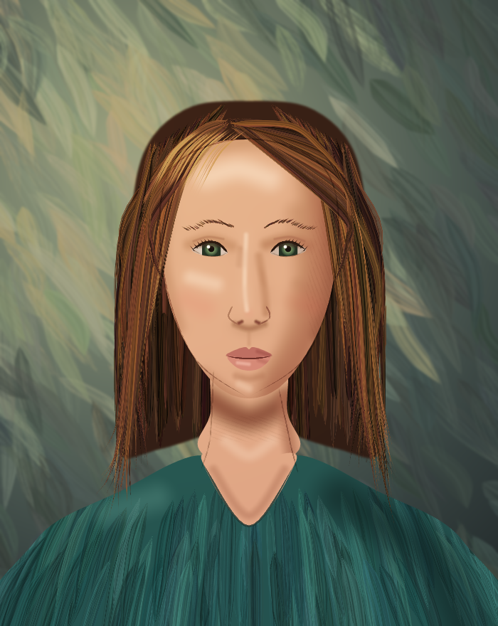
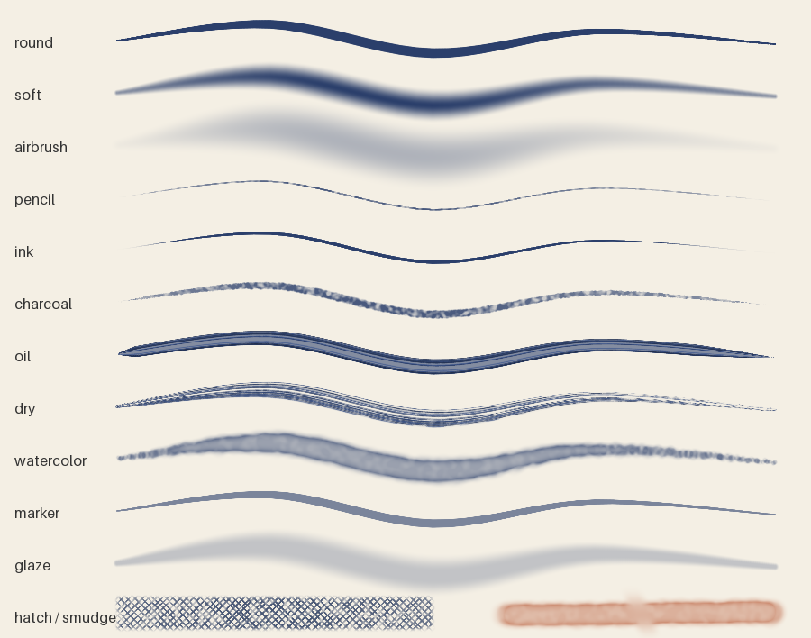

# pdnart: make art for paint.net with code or with Claude

paint.net has no scripting API. `pdnart` gives you one another way. You describe a picture as a
**layered scene**, and pdnart paints it and rebuilds it inside paint.net as a real multi-layer
document that you can keep editing by hand.

It paints with a **natural-media brush engine**, not only simple shapes:

- pencil, ink, charcoal, oil (with visible bristle streaks), dry brush, watercolor (pigment pools at
  the edges), marker, airbrush, soft brush and glaze
- stylus-style pressure on each point, tapering, hand wobble and paper grain
- a smudge tool for blending, and hatching and cross-hatching for pencil shading
- selections (`clip`), `lock_alpha` for shading inside a shape, an eraser, and layer blend modes

| Landscape: 3,200 strokes over 8 layers | Portrait: 1,450 strokes over 8 layers |
|---|---|
|  |  |

*The two scenes above are made entirely from pdnart ops: brush strokes, smudging, hatching and
pencil linework on a multiply layer. They are generated by `examples/landscape.py` and
`examples/portrait.py`. The brush presets side by side:*



## How it talks to paint.net

pdnart does not click around the canvas pixel by pixel, because that approach is slow and
breaks easily. It uses the two things paint.net reliably supports:

1. **The clipboard.** Each layer is rendered at full canvas size and placed on the clipboard as a
   PNG, which keeps transparency.
2. **Keyboard shortcuts**, sent with `pywinauto`:
   - `Ctrl+Alt+V` (Paste into New Image) for the background
   - `Ctrl+Shift+V` (Paste into New Layer) for each scene layer
   - `F4` (Layer Properties) to name the layer and set its blend mode
   - `Ctrl+Shift+S` to optionally save a `.pdn`

Brush strokes are rendered by pdnart's own engine and arrive in paint.net as pixels on the right
layers. paint.net's own brush tools are not used, because they can't be driven with precise
pressure, colour and positioning.

Limitations:
- Layer opacity is baked into the pasted pixels.
- Hidden layers are skipped.
- If paint.net's dialog can't be read, a blend mode may not get set. pdnart then warns you, and you can
  set it with `F4`.
- Don't touch the mouse or keyboard while pdnart sends a scene.

## Install

```bash
pip install -e ".[windows,mcp]"   # on the Windows machine that has paint.net
pip install -e .                  # render-only, any OS
```

If paint.net isn't in `C:\Program Files\paint.net\`, set the `PDN_EXE` environment variable to
your `paintdotnet.exe`.

## Use it from the command line

```bash
pdnart render examples/portrait.json -o art.png --layers layers/          # any OS
pdnart send   examples/portrait.json --save C:\art\portrait.pdn             # Windows + paint.net
```

If paint.net is slow on your machine and steps get skipped, increase `--delay` (seconds between
UI steps, default 0.6).

## Let Claude paint (MCP)

Add the server to Claude Desktop (`claude_desktop_config.json`):

```json
{ "mcpServers": { "pdnart": { "command": "pdnart", "args": ["mcp"] } } }
```

or to Claude Code: `claude mcp add pdnart -- pdnart mcp`.

Then ask something like *"Paint a portrait of an old fisherman in oils, with a pencil underdrawing,
and open it in paint.net."* The server's instructions tell Claude to work like a painter:
1. sketch
2. block in
3. model light and shadow inside the shapes
4. blend
5. add detail
6. add linework

Claude checks its progress with `preview` as it goes. Claude gets these tools:

| tool | what it does |
|---|---|
| `op_reference` | lists the drawing ops and brush presets |
| `new_canvas`, `add_layer`, `set_layer` | set up the canvas and layers (opacity, blend mode, visibility) |
| `draw`, `undo` | add or remove ops on a layer; `paths` paints many strokes in one op |
| `preview` | returns the rendered image; `grid=true` labels coordinates and `region=[x,y,w,h]` zooms in on details |
| `get_scene`, `load_scene`, `save_files` | JSON, PNG and JPG in and out |
| `send_to_paintnet` | builds the layered document in paint.net, optionally saving a `.pdn` |

Layers are cached, so after Claude changes one layer, only that layer is re-rendered.

## Scene format

```json
{
  "width": 800, "height": 500, "background": "#0b1033",
  "layers": [
    {"name": "Moon", "opacity": 1.0, "visible": true, "ops": [
      {"op": "ellipse", "cx": 610, "cy": 115, "rx": 38, "ry": 38, "fill": "#fff6d8"}
    ]}
  ]
}
```

Layers are listed back to front and take `opacity`, `visible` and `blend` (`normal`, `multiply`,
`screen`, `overlay`, `darken`, `lighten`, `additive`, `difference`). Colors can be `#rrggbb`,
`#rrggbbaa`, CSS names, or `[r, g, b, a]`.

A brush stroke looks like this:

```json
{"op": "brush", "brush": "pencil", "color": "#3b3531", "size": 2.5,
 "points": [[120, 300, 0.2], [180, 260, 0.9], [260, 250, 1.0], [330, 280, 0.3]]}
```

Each point is `[x, y]` or `[x, y, pressure]`, and pressure (0 to 1) swells and thins the line like a
stylus. Pass `"paths": [[...], [...]]` instead of `points` to paint many strokes with the same brush.
Any brush setting can be overridden per stroke: `size`, `hardness`, `flow`, `opacity`, `spacing`,
`taper`, `jitter`, `size_jitter`, `wobble`, `grain`, `grain_scale`, `bristles`, `dryness`,
`color_variation`, `wet_edge`, `pressure_size`, `pressure_opacity` and `smooth`.

| brush | character |
|---|---|
| `pencil` | thin graphite line with paper grain, pressure and wobble |
| `ink` | crisp line that swells with pressure and tapers at both ends |
| `charcoal` | broad, grainy and broken |
| `oil` | bristle streaks in three tints over a semi-opaque body |
| `dry` | broken dry-brush streaks that run out of paint |
| `watercolor` | translucent wash that builds up, with darker pooled edges |
| `soft`, `airbrush`, `glaze` | soft-edged shading and glazing |
| `round`, `marker` | plain round brush / flat translucent marker |

| op | required | optional |
|---|---|---|
| `brush` | points *or* paths | brush, color, seed, any brush setting |
| `hatch` | region (polygon) | angle, gap, cross, brush, color, brush settings |
| `smudge` | points *or* paths | size, strength, hardness, lock_alpha |
| `rect` | x, y, w, h | fill, stroke, width, radius, feather |
| `ellipse` | cx, cy, rx, ry | angle, fill, stroke, width, feather |
| `polygon` | points | smooth (organic curves), fill, stroke, width, feather |
| `stroke` / `line` | points *or* paths / points | color, width |
| `gradient` | stops `[[0..1, color], …]` | kind (`linear`: x0,y0,x1,y1 / `radial`: cx,cy,r) |
| `scatter` | count | region `[x,y,w,h]`, radius `[min,max]`, colors, seed, shape (`circle`/`star`) |
| `text` | x, y, text | size, color, font (.ttf path), anchor |
| `image` | path | x, y, w, h (for example, a reference photo on a hidden layer) |
| `blur` | radius | clip |
| `fill` | color | – |

Every painting op also accepts:
- `opacity`
- `lock_alpha`: paint only where the layer already has paint, e.g. shading inside a face you blocked
  in
- `erase`
- `clip`: a selection the op is confined to, as `[[x,y],…]` or `{points, smooth, feather, invert}`

## Development

```bash
pip install -e ".[dev,mcp]" && pytest
```

The renderer, the scene model and the MCP server are tested on any OS. The paint.net driver
(`pdnart/paintnet.py`) only runs on Windows with paint.net installed.
